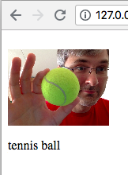
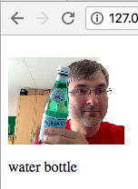

# WebRTC object recognition example with TensorFlow.js

Example of WebRTC video stream image recognition in browser with TensorFlow.js

# Online demo

<a href="https://alexkorep.github.io/webrtc-tensorflowjs-example/" target="_blank">Online demo</a>

# Screenshots

# Prerequisites

- Python 3
- PIP
- Virtualenv

# Installation

- Create virtualenvironment `virtualenv -p python3 env`
- Activate the environment `source env/bin/activate`
- Install Python dependencies `pip install -r requirements.txt`
- Run the script to create a Keras model `python makemodel.py`
- Convert the model into Tensorflow.js format `tensorflowjs_converter --input_format keras ./model.h5 ./jsmodel/`
- Open `test.html` in your browser. In order for WebRTC to work the page should be opened on https or via http from localhost.
  If you have PHP installed it's the easiest would be to do `php -S 127.0.0.1:8077` and open http://127.0.0.1:8077 in your browser.

